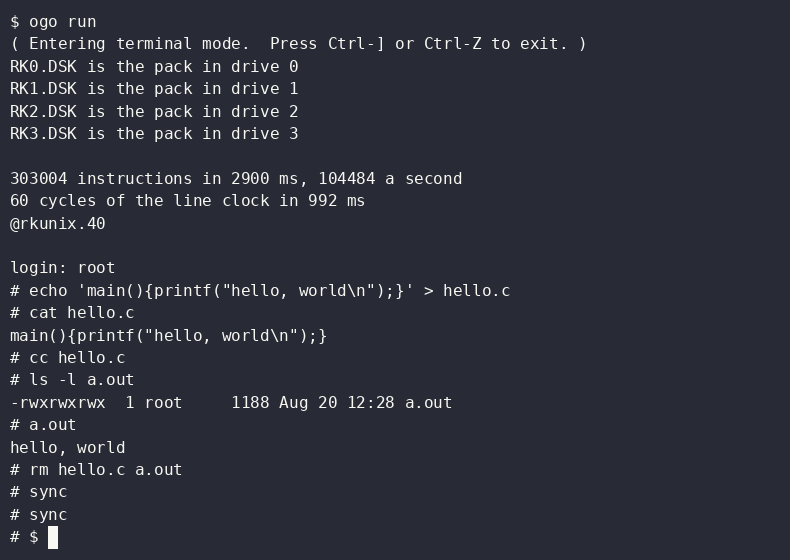

# p2-11

A PDP-11/40 on a [Parallax Propeller 2](https://www.parallax.com/propeller-2/),
written in [OctoGo](https://pkg.go.dev/modernc.org/ogo).

OctoGo is a Go-like language for the Propeller 2 in which a goroutine is one of
the chip's eight cores. This is the first program of any size written in it,
and it is here as much to show what such a program looks like as to run a
PDP-11.

## Status

The processor, the console, the line clock, the disk and the memory
management are there, with 248 KB of memory, and two systems run from a pack
on the SD card: RT-11 V4, and Unix V6, which logs in, compiles a C program
with its own compiler and runs it, on the board as in SimH.

The instructions a program mostly executes are executed by a core in the
Propeller's own assembly, on a cog of its own, which OctoGo carries as a Spin2
object: [core](core). It makes the machine five times as fast as its OctoGo
alone, and about one and a half times as fast as an 11/40 was. What the core
leaves, the devices, traps and interrupts and the rarer instructions, is the
OctoGo machine's, which is also what the core is tested against, instruction
by instruction.

```
$ ogo run
303004 instructions in 401 ms, 755620 a second
60 cycles of the line clock in 988 ms

PDP-11/40 on a Propeller 2, in OctoGo
28K words of memory
Type; control-D halts.
```

The first line is the emulator timing itself on a loop, and the second how long
a PDP-11 program, [mac/ticks.mac](mac/ticks.mac), waited for sixty interrupts
of the clock, the first of which was on its way when it began. The rest is
[mac/demo.mac](mac/demo.mac): it finds out how much memory there is by
reading upwards until the bus times out and the processor traps, prints that in
decimal with the extended instruction set's DIV, and then waits, the console's
receiver interrupting for every key.

That is what the machine does with no disk. With an SD card in the slot that
has a file `RK0.DSK`, it begins with what is on that pack:

```
RK0.DSK is the pack in drive 0
...
RT-11SJ  V04.00C

.
```

or, with the root pack of Unix V6 there instead:

```
RK0.DSK is the pack in drive 0
...
@rkunix.40

login: root
# cc hello.c
# a.out
hello, world
#
```

The `@` is the bootstrap of Unix asking for a file to load and start:
`rkunix.40` is the kernel built for the 11/40, while `rkunix` and `unix` are
the 11/45's and halt it. `root` logs in with no password.



That is the board, recorded at real speed: 45 seconds from `ogo run` to the
last `sync`, the first eight and a half of them the build, the load and the
emulator timing itself. [scripts/record.py](scripts/record.py) makes the
recording.

| | |
| --- | --- |
| KD11-A processor with the KE11-E extended instruction set | there |
| traps, interrupts, the trace bit, the stack limit | there |
| DL11 console, on the serial line the program is loaded through | there |
| KW11-L line clock | there |
| the SD card's blocks, and where a file of its FAT32 volume is | there |
| RK11 disk with RK05 drives, a file on the SD card for a pack | there |
| RT-11 V4, the single job monitor | runs |
| Unix V6 | runs, and compiles |
| KT11-D memory management, 248 KB | there |
| a VT100 on a VGA monitor of its own, for the console | begun: the terminal and the screen are there, and wait for a monitor on the board |

The processor is tested against the PDP-11/40 of
[SimH](https://opensimh.org): 2902 cases of a machine before an instruction and
after it, 522 of them the memory management's, on the board and on the machine
the program is written on. A sweep of 15,685 more agrees as well. The disk is tested against SimH's too, with a
program of 35 steps, [mac/disk.mac](mac/disk.mac). And so is all of it: a talk
with RT-11 in which a file is copied, compared and deleted says on the board
what it says in SimH, and leaves on the card what SimH leaves in its file;
and a talk with Unix V6 in which a C program is written, compiled and run
says on the board what it says in SimH.

Where it is not an 11/40: an interrupt a device asks for is taken when the
machine next asks the devices, every 32 instructions, every 256 with the core,
and at once after an instruction that touched a device or the status word. An
11/40 takes it after the instruction during which it was asked for. Neither
RT-11 nor Unix V6 minds, and when a device asks is the emulator's to say
anyway, as it is SimH's.

## Running it

It needs a Propeller 2 board and OctoGo. It was written with a P2 Edge module,
P2-EC, and needs `ogo` v0.47.0 or a later one, the core being a Spin2 object;
its tests want v0.47.1. v0.48.0 is the one it was last measured with:

```sh
go install modernc.org/ogo@v0.48.0
```

Without Go, a binary of it for Linux, macOS or Windows is among
[its releases](https://github.com/modernc-org/ogo/releases), v0.48.0's among
them.

```sh
ogo run                                  # build, load, and open a terminal
ogo build --unchecked --clock 200MHz     # as fast as it goes: 952,842 a second
ogo test ./...                           # the tests, on the board
scripts/twin.sh                          # the packages' tests under Go, no board needed
scripts/talk.py                          # a talk with RT-11 on the pack, on the board and in SimH
scripts/talk.py -talk v6                 # and one with Unix V6
scripts/card.py put RK0.DSK RK0.DSK      # a pack onto the card, through the board
```

## How it is put together

| | |
| --- | --- |
| [main.ogo](main.ogo), [disk.ogo](disk.ogo) | the program: six cogs, one stepping the machine, one executing what it can of its instructions, one reading the serial line, one writing it, one counting the cycles of the line clock, one moving blocks between the card and memory |
| [pdp11](pdp11) | the machine: processor, memory, bus, traps and interrupts |
| [core](core) | its common instructions in PASM, on a cog of their own |
| [dl11](dl11) | the console |
| [kw11](kw11) | the line clock |
| [rk11](rk11) | the disk controller and its drives |
| [sd](sd) | an SD card's blocks, read and written over SPI |
| [card](card) | a second program: puts a file onto the card and sums one there, over the serial line |
| [prof](prof) | a third: runs each shape of instruction in a loop and says what one costs in clocks |
| [fat](fat) | where on a disk a file of its FAT32 volume is |
| [mac](mac) | the PDP-11 programs it carries, in MACRO-11 and assembled |
| [vt100](vt100) | a VT100's screen: what a host's characters and sequences do to it |
| [vga](vga) | that screen on a VGA monitor, with [Eric Smith's tile driver](https://github.com/totalspectrum/p2_vga_text) and Unscii's font |
| [scripts](scripts) | what makes the test vectors, assembles the programs, makes the font, runs the tests under Go, and draws the logo |

The cogs share memory and no lock: every variable a device's cog shares with
the machine is written by one of them only, and the machine's cog and the
core's take turns at the machine's state, the one waiting while the other runs.
The disk writes what it reads to memory between two instructions, when the
machine's cog lends it the bus, so that it cannot come between an
instruction's read of a word and its writing back, as on a PDP-11.

Only the three programs, `core`, `sd` and `vga` know about the Propeller 2.
The other packages are Go once they are given a package clause, which is how
their tests also run where there is no board. `sd`, `fat`, `vt100` and `vga`
know nothing about the PDP-11.

What writing it found out about OctoGo is in [OCTOGO.md](OCTOGO.md).

## A disk

A pack is a file on the card: `RK0.DSK` for drive 0, and so on to `RK7.DSK`,
and the machine begins with what is in drive 0, RT-11 or Unix as the file is.
The card is an SD card of any size with a FAT32 volume, and the file is an
image of an RK05 pack, 2,494,464 bytes, copied to a card that has not had a
file deleted, so that it is in one piece.

```sh
truncate -s 2494464 RK0.DSK              # an image that is shorter is made a whole pack
cp RK0.DSK /media/card/ && sync
```

Once a file is on the card it is written again through the board, the card
staying in its slot: `scripts/card.py put RK0.DSK RK0.DSK` sends the image
over the serial line and reads it back, in two minutes, and `scripts/card.py
sum RK0.DSK RK0.DSK` says which of its blocks differ from the image.

## Software for it

None is in this repository and none will be. What runs on a PDP-11 is, for the
most part, not free to pass on; what is, the early Unix versions among it, is
fetched from where it is kept.

Unix V6 is in SimH's software kits, as
[uv6swre.zip](https://simh.trailing-edge.com/kits/uv6swre.zip): four RK05 packs,
under the Caldera license that is in the zip. Its root pack, `unix0_v6_rk.dsk`,
is `RK0.DSK`, made a whole pack as above. The pack has two faults: its free
list holds block 654 three times, so that files written after it boots share a
block and the C compiler fails, and `/tmp` still has a temporary file of the
compiler's from 1994. Both are put right once, on the board, before anything
else is done with the pack:

```
@rkunix.40

login: root
# rm -f /tmp/ctm0a
# sync
# icheck -s /dev/rk0
/dev/rk0:
#
```

Then the terminal is left, Ctrl-], and nothing else is typed first: until the
board is reset the system keeps the old free list, and the next file written
puts it back. After that `icheck /dev/rk0` finds nothing wrong, and `cc`
compiles.

The other three packs need no mending. Made whole and copied to the card as
`RK1.DSK`, `RK2.DSK` and `RK3.DSK`, they are mounted when the system starts, as
`/usr`, `/usr/source` and `/mnt`; without them `/usr` is empty. The manual is
then in `/mnt/man`. There is no `man` command, but this prints a page:

```
# nroff /mnt/man/man0/naa /mnt/man/man1/ls.1 | tr -d '\010_'
```

`nroff` underlines a word by backspacing over it and typing underscores, which
a terminal of today shows as the underscores alone; the `tr` takes them out.

## License

BSD-3-Clause, see [LICENSE](LICENSE).

SimH was the reference for what a PDP-11/40 does, and the programs in `mac/` are
assembled with Richard Krehbiel's macro11. Neither is part of this repository;
`scripts/tools.sh` fetches both, at the revisions that were used.
